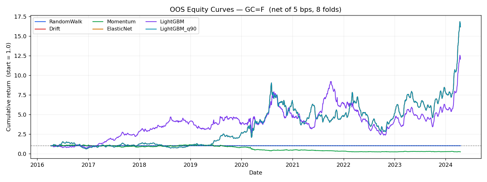
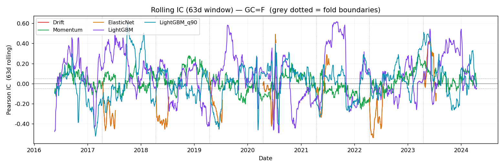

# Backtest Report — GC=F

**Date:** 2026-05-31  **Config:** `4e0f759a`  **Ticker:** GC=F

---

## Configuration

| Parameter | Value |
|:----------|:------|
| Period | 2010-01-01 → 2024-12-31 |
| Horizon | 5 trading day(s) |
| Cost | 5.0 bps round-trip |
| Folds | 8 × 1yr test, 3yr min train |
| Embargo | 5 trading days |
| Random seed | 42 |
| Config hash | `4e0f759a` |

---

## Verdict

⚠️ LEAKAGE FLAG — LightGBM triggered the IC > 0.05 or Sharpe > 2.5 threshold and must be investigated for data leakage before any conclusions are drawn. All other models show near-zero IC on GC=F at the 5-day horizon over 2010-01-01–2024-12-31 (8 OOS folds, 5.0 bps cost), consistent with an efficient market. No exploitable edge is claimed.

---

## Model Comparison

| model        |   n_folds |   mean_IC |   rank_IC |   IC_stability |   pooled_IC |   hit_rate |   Sharpe_net |   ann_ret |   max_dd |   turnover |
|:-------------|----------:|----------:|----------:|---------------:|------------:|-----------:|-------------:|----------:|---------:|-----------:|
| RandomWalk   |         8 |  nan      |  nan      |         nan    |    nan      |    nan     |       nan    |     0     |    0     |      0     |
| Drift        |         8 |  nan      |  nan      |         nan    |     -0.0055 |      0.548 |         0.54 |     0.078 |   -0.209 |      0     |
| Momentum     |         8 |    0.01   |    0.0128 |           0.75 |      0.0062 |      0.501 |         0.38 |     0.055 |   -0.191 |      1.01  |
| ElasticNet   |         8 |  nan      |  nan      |         nan    |     -0.0055 |      0.548 |         0.54 |     0.078 |   -0.209 |      0     |
| LightGBM     |         8 |    0.0985 |    0.0844 |           0.88 |      0.0709 |      0.531 |         0.28 |     0.04  |   -0.35  |      0.337 |
| LightGBM_q90 |         8 |    0.0524 |    0.0362 |           0.88 |      0.013  |      0.548 |         0.54 |     0.078 |   -0.209 |      0     |

---

## Figures

**Equity curves:** `outputs/figures/equity_GC_eq_F_2026-05-31_4e0f759a.png`

**Rolling IC (63d):** `outputs/figures/rolling_ic_GC_eq_F_2026-05-31_4e0f759a.png`

---

## Per-fold detail

### RandomWalk

|   fold | test_start   | test_end   |   train_rows |   IC |   rank_IC |   DA |
|-------:|:-------------|:-----------|-------------:|-----:|----------:|-----:|
|      0 | 2016-04-08   | 2017-04-10 |         1512 |  nan |       nan |  nan |
|      1 | 2017-04-11   | 2018-04-12 |         1764 |  nan |       nan |  nan |
|      2 | 2018-04-13   | 2019-04-12 |         2016 |  nan |       nan |  nan |
|      3 | 2019-04-15   | 2020-04-14 |         2268 |  nan |       nan |  nan |
|      4 | 2020-04-15   | 2021-04-14 |         2520 |  nan |       nan |  nan |
|      5 | 2021-04-15   | 2022-04-12 |         2772 |  nan |       nan |  nan |
|      6 | 2022-04-13   | 2023-04-14 |         3024 |  nan |       nan |  nan |
|      7 | 2023-04-17   | 2024-04-16 |         3276 |  nan |       nan |  nan |

### Drift

|   fold | test_start   | test_end   |   train_rows |   IC |   rank_IC |    DA |
|-------:|:-------------|:-----------|-------------:|-----:|----------:|------:|
|      0 | 2016-04-08   | 2017-04-10 |         1512 |  nan |       nan | 0.508 |
|      1 | 2017-04-11   | 2018-04-12 |         1764 |  nan |       nan | 0.536 |
|      2 | 2018-04-13   | 2019-04-12 |         2016 |  nan |       nan | 0.496 |
|      3 | 2019-04-15   | 2020-04-14 |         2268 |  nan |       nan | 0.655 |
|      4 | 2020-04-15   | 2021-04-14 |         2520 |  nan |       nan | 0.563 |
|      5 | 2021-04-15   | 2022-04-12 |         2772 |  nan |       nan | 0.611 |
|      6 | 2022-04-13   | 2023-04-14 |         3024 |  nan |       nan | 0.476 |
|      7 | 2023-04-17   | 2024-04-16 |         3276 |  nan |       nan | 0.54  |

### Momentum

|   fold | test_start   | test_end   |   train_rows |      IC |   rank_IC |    DA |
|-------:|:-------------|:-----------|-------------:|--------:|----------:|------:|
|      0 | 2016-04-08   | 2017-04-10 |         1512 |  0.0299 |    0.0317 | 0.512 |
|      1 | 2017-04-11   | 2018-04-12 |         1764 |  0.0106 |    0.0167 | 0.508 |
|      2 | 2018-04-13   | 2019-04-12 |         2016 |  0.0933 |    0.113  | 0.566 |
|      3 | 2019-04-15   | 2020-04-14 |         2268 | -0.0609 |   -0.0729 | 0.448 |
|      4 | 2020-04-15   | 2021-04-14 |         2520 |  0.0072 |    0.0028 | 0.502 |
|      5 | 2021-04-15   | 2022-04-12 |         2772 | -0.088  |   -0.0761 | 0.436 |
|      6 | 2022-04-13   | 2023-04-14 |         3024 |  0.0624 |    0.0419 | 0.51  |
|      7 | 2023-04-17   | 2024-04-16 |         3276 |  0.0258 |    0.045  | 0.53  |

### ElasticNet

|   fold | test_start   | test_end   |   train_rows |   IC |   rank_IC |    DA |
|-------:|:-------------|:-----------|-------------:|-----:|----------:|------:|
|      0 | 2016-04-08   | 2017-04-10 |         1512 |  nan |       nan | 0.508 |
|      1 | 2017-04-11   | 2018-04-12 |         1764 |  nan |       nan | 0.536 |
|      2 | 2018-04-13   | 2019-04-12 |         2016 |  nan |       nan | 0.496 |
|      3 | 2019-04-15   | 2020-04-14 |         2268 |  nan |       nan | 0.655 |
|      4 | 2020-04-15   | 2021-04-14 |         2520 |  nan |       nan | 0.563 |
|      5 | 2021-04-15   | 2022-04-12 |         2772 |  nan |       nan | 0.611 |
|      6 | 2022-04-13   | 2023-04-14 |         3024 |  nan |       nan | 0.476 |
|      7 | 2023-04-17   | 2024-04-16 |         3276 |  nan |       nan | 0.54  |

### LightGBM

|   fold | test_start   | test_end   |   train_rows |      IC |   rank_IC |    DA |
|-------:|:-------------|:-----------|-------------:|--------:|----------:|------:|
|      0 | 2016-04-08   | 2017-04-10 |         1512 |  0.0726 |    0.1109 | 0.524 |
|      1 | 2017-04-11   | 2018-04-12 |         1764 |  0.252  |    0.1881 | 0.607 |
|      2 | 2018-04-13   | 2019-04-12 |         2016 | -0.0504 |   -0.0361 | 0.508 |
|      3 | 2019-04-15   | 2020-04-14 |         2268 |  0.1235 |    0.1119 | 0.512 |
|      4 | 2020-04-15   | 2021-04-14 |         2520 |  0.075  |    0.0469 | 0.536 |
|      5 | 2021-04-15   | 2022-04-12 |         2772 |  0.2048 |    0.1895 | 0.548 |
|      6 | 2022-04-13   | 2023-04-14 |         3024 |  0.0242 |   -0.0301 | 0.472 |
|      7 | 2023-04-17   | 2024-04-16 |         3276 |  0.0858 |    0.0945 | 0.54  |

### LightGBM_q90

|   fold | test_start   | test_end   |   train_rows |      IC |   rank_IC |    DA |
|-------:|:-------------|:-----------|-------------:|--------:|----------:|------:|
|      0 | 2016-04-08   | 2017-04-10 |         1512 | -0.0914 |   -0.1182 | 0.508 |
|      1 | 2017-04-11   | 2018-04-12 |         1764 |  0.0578 |    0.0787 | 0.536 |
|      2 | 2018-04-13   | 2019-04-12 |         2016 |  0.018  |    0.019  | 0.496 |
|      3 | 2019-04-15   | 2020-04-14 |         2268 |  0.0665 |    0.0114 | 0.655 |
|      4 | 2020-04-15   | 2021-04-14 |         2520 |  0.1663 |    0.1579 | 0.563 |
|      5 | 2021-04-15   | 2022-04-12 |         2772 |  0.0511 |    0.0403 | 0.611 |
|      6 | 2022-04-13   | 2023-04-14 |         3024 |  0.1153 |    0.1128 | 0.476 |
|      7 | 2023-04-17   | 2024-04-16 |         3276 |  0.0354 |   -0.0121 | 0.54  |

---

*Research tooling only — not investment advice.*