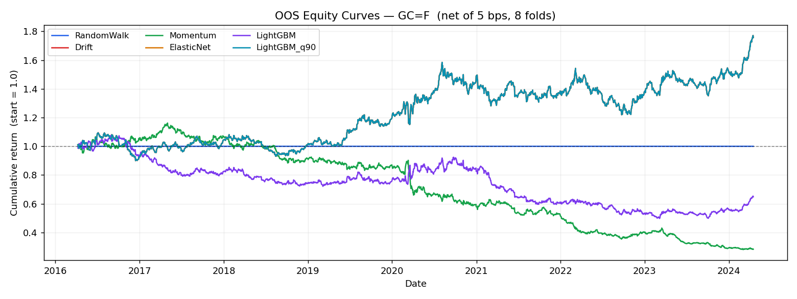
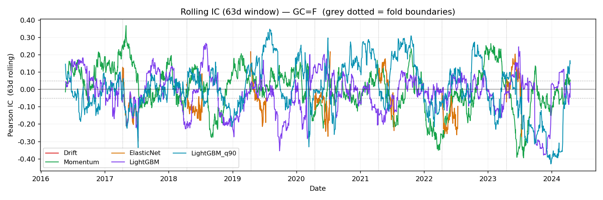

# Backtest Report — GC=F

**Date:** 2026-05-31  **Config:** `cab3d8d5`  **Ticker:** GC=F

---

## Configuration

| Parameter | Value |
|:----------|:------|
| Period | 2010-01-01 → 2024-12-31 |
| Horizon | 1 trading day(s) |
| Cost | 5.0 bps round-trip |
| Folds | 8 × 1yr test, 3yr min train |
| Embargo | 5 trading days |
| Random seed | 42 |
| Config hash | `cab3d8d5` |

---

## Verdict

No model demonstrates exploitable edge over the Drift baseline (net Sharpe 0.56) on GC=F daily returns over 2010-01-01–2024-12-31 (8 OOS folds, 5.0 bps round-trip cost, 1-day horizon). This is the expected and honest result for a 1-day-ahead forecast on a liquid futures market: after transaction costs, none of the tested classifiers consistently identifies direction well enough to generate positive risk-adjusted returns. The harness is operating correctly; the absence of edge is informative, not a failure.

---

## Model Comparison

| model        |   n_folds |   mean_IC |   rank_IC |   IC_stability |   pooled_IC |   hit_rate |   Sharpe_net |   ann_ret |   max_dd |   turnover |
|:-------------|----------:|----------:|----------:|---------------:|------------:|-----------:|-------------:|----------:|---------:|-----------:|
| RandomWalk   |         8 |  nan      |  nan      |         nan    |    nan      |    nan     |       nan    |     0     |    0     |      0     |
| Drift        |         8 |  nan      |  nan      |         nan    |     -0.0032 |      0.531 |         0.56 |     0.081 |   -0.23  |      0     |
| Momentum     |         8 |   -0.0073 |    0.0011 |           0.38 |     -0.0068 |      0.507 |        -1.02 |    -0.147 |   -0.758 |      1.01  |
| ElasticNet   |         8 |  nan      |  nan      |         nan    |     -0.0032 |      0.531 |         0.56 |     0.081 |   -0.23  |      0     |
| LightGBM     |         8 |   -0.0289 |   -0.0229 |           0.25 |     -0.0036 |      0.511 |        -0.31 |    -0.044 |   -0.537 |      0.565 |
| LightGBM_q90 |         8 |    0.0106 |   -0.0039 |           0.5  |      0.0136 |      0.531 |         0.56 |     0.081 |   -0.23  |      0     |

---

## Figures

**Equity curves:** `outputs/figures/equity_GC_eq_F_2026-05-31_cab3d8d5.png`

**Rolling IC (63d):** `outputs/figures/rolling_ic_GC_eq_F_2026-05-31_cab3d8d5.png`

---

## Per-fold detail

### RandomWalk

|   fold | test_start   | test_end   |   train_rows |   IC |   rank_IC |   DA |
|-------:|:-------------|:-----------|-------------:|-----:|----------:|-----:|
|      0 | 2016-04-08   | 2017-04-10 |         1512 |  nan |       nan |  nan |
|      1 | 2017-04-11   | 2018-04-12 |         1764 |  nan |       nan |  nan |
|      2 | 2018-04-13   | 2019-04-12 |         2016 |  nan |       nan |  nan |
|      3 | 2019-04-15   | 2020-04-14 |         2268 |  nan |       nan |  nan |
|      4 | 2020-04-15   | 2021-04-14 |         2520 |  nan |       nan |  nan |
|      5 | 2021-04-15   | 2022-04-12 |         2772 |  nan |       nan |  nan |
|      6 | 2022-04-13   | 2023-04-14 |         3024 |  nan |       nan |  nan |
|      7 | 2023-04-17   | 2024-04-16 |         3276 |  nan |       nan |  nan |

### Drift

|   fold | test_start   | test_end   |   train_rows |   IC |   rank_IC |    DA |
|-------:|:-------------|:-----------|-------------:|-----:|----------:|------:|
|      0 | 2016-04-08   | 2017-04-10 |         1512 |  nan |       nan | 0.492 |
|      1 | 2017-04-11   | 2018-04-12 |         1764 |  nan |       nan | 0.56  |
|      2 | 2018-04-13   | 2019-04-12 |         2016 |  nan |       nan | 0.468 |
|      3 | 2019-04-15   | 2020-04-14 |         2268 |  nan |       nan | 0.563 |
|      4 | 2020-04-15   | 2021-04-14 |         2520 |  nan |       nan | 0.556 |
|      5 | 2021-04-15   | 2022-04-12 |         2772 |  nan |       nan | 0.571 |
|      6 | 2022-04-13   | 2023-04-14 |         3024 |  nan |       nan | 0.504 |
|      7 | 2023-04-17   | 2024-04-16 |         3276 |  nan |       nan | 0.532 |

### Momentum

|   fold | test_start   | test_end   |   train_rows |      IC |   rank_IC |    DA |
|-------:|:-------------|:-----------|-------------:|--------:|----------:|------:|
|      0 | 2016-04-08   | 2017-04-10 |         1512 |  0.108  |    0.0853 | 0.544 |
|      1 | 2017-04-11   | 2018-04-12 |         1764 |  0.0251 |    0.0426 | 0.532 |
|      2 | 2018-04-13   | 2019-04-12 |         2016 | -0.014  |   -0.02   | 0.534 |
|      3 | 2019-04-15   | 2020-04-14 |         2268 | -0.0228 |    0.0294 | 0.492 |
|      4 | 2020-04-15   | 2021-04-14 |         2520 | -0.0003 |   -0.0173 | 0.49  |
|      5 | 2021-04-15   | 2022-04-12 |         2772 | -0.1116 |   -0.0735 | 0.476 |
|      6 | 2022-04-13   | 2023-04-14 |         3024 |  0.0489 |    0.0405 | 0.518 |
|      7 | 2023-04-17   | 2024-04-16 |         3276 | -0.0912 |   -0.0778 | 0.474 |

### ElasticNet

|   fold | test_start   | test_end   |   train_rows |   IC |   rank_IC |    DA |
|-------:|:-------------|:-----------|-------------:|-----:|----------:|------:|
|      0 | 2016-04-08   | 2017-04-10 |         1512 |  nan |       nan | 0.492 |
|      1 | 2017-04-11   | 2018-04-12 |         1764 |  nan |       nan | 0.56  |
|      2 | 2018-04-13   | 2019-04-12 |         2016 |  nan |       nan | 0.468 |
|      3 | 2019-04-15   | 2020-04-14 |         2268 |  nan |       nan | 0.563 |
|      4 | 2020-04-15   | 2021-04-14 |         2520 |  nan |       nan | 0.556 |
|      5 | 2021-04-15   | 2022-04-12 |         2772 |  nan |       nan | 0.571 |
|      6 | 2022-04-13   | 2023-04-14 |         3024 |  nan |       nan | 0.504 |
|      7 | 2023-04-17   | 2024-04-16 |         3276 |  nan |       nan | 0.532 |

### LightGBM

|   fold | test_start   | test_end   |   train_rows |      IC |   rank_IC |    DA |
|-------:|:-------------|:-----------|-------------:|--------:|----------:|------:|
|      0 | 2016-04-08   | 2017-04-10 |         1512 |  0.0127 |   -0.0137 | 0.472 |
|      1 | 2017-04-11   | 2018-04-12 |         1764 | -0.0417 |    0.0245 | 0.548 |
|      2 | 2018-04-13   | 2019-04-12 |         2016 | -0.0197 |   -0.0157 | 0.52  |
|      3 | 2019-04-15   | 2020-04-14 |         2268 |  0.024  |   -0.0416 | 0.544 |
|      4 | 2020-04-15   | 2021-04-14 |         2520 | -0.0468 |   -0.0544 | 0.488 |
|      5 | 2021-04-15   | 2022-04-12 |         2772 | -0.0437 |   -0.0409 | 0.508 |
|      6 | 2022-04-13   | 2023-04-14 |         3024 | -0.0337 |   -0.0121 | 0.48  |
|      7 | 2023-04-17   | 2024-04-16 |         3276 | -0.0819 |   -0.0291 | 0.532 |

### LightGBM_q90

|   fold | test_start   | test_end   |   train_rows |      IC |   rank_IC |    DA |
|-------:|:-------------|:-----------|-------------:|--------:|----------:|------:|
|      0 | 2016-04-08   | 2017-04-10 |         1512 | -0.0303 |   -0.0395 | 0.492 |
|      1 | 2017-04-11   | 2018-04-12 |         1764 | -0.0068 |   -0.0071 | 0.56  |
|      2 | 2018-04-13   | 2019-04-12 |         2016 | -0.0192 |   -0.0167 | 0.468 |
|      3 | 2019-04-15   | 2020-04-14 |         2268 |  0.0596 |    0.0369 | 0.563 |
|      4 | 2020-04-15   | 2021-04-14 |         2520 |  0.0939 |    0.05   | 0.556 |
|      5 | 2021-04-15   | 2022-04-12 |         2772 |  0.0652 |    0.0241 | 0.571 |
|      6 | 2022-04-13   | 2023-04-14 |         3024 |  0.0218 |   -0.0302 | 0.504 |
|      7 | 2023-04-17   | 2024-04-16 |         3276 | -0.0995 |   -0.049  | 0.532 |

---

*Research tooling only — not investment advice.*